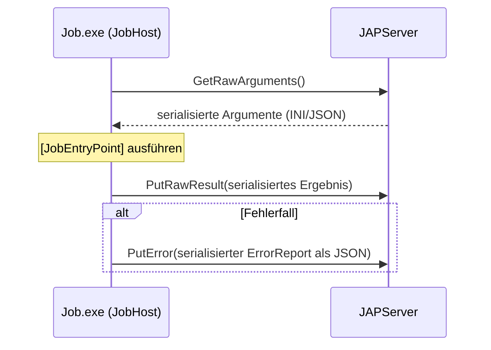

# JOSYN.Jap.Shared.Contract

Part of the **JOSYN** (JobSystem Next) ecosystem — member of the `JOSYN.Jap.Shared` layer.

`JOSYN.Jap.Shared.Contract` definiert den Applikations-Vertrag zwischen den beiden
JOSYN-Systemkomponenten: dem **JobHost** (Frontend) und dem **JAPServer** (Backend).

Dieser Vertrag ist transportunabhängig — er beschreibt ausschließlich, *was* ausgetauscht
wird, nicht *wie* (das ist Aufgabe von `JOSYN.Foundation.JIP`).

---

## Überblick

Das JOSYN Application Protocol (JAP) definiert einen minimalen, rohen Datenaustausch:



Der Vertrag ist bewusst auf drei Methoden reduziert. Serialisierung und Deserialisierung
liegen im Verantwortungsbereich der jeweiligen Implementierung.

---

## Vertrag

### `IJosynApplicationProtocol`

| Methode | Beschreibung |
|---|---|
| `GetRawArguments()` | Ruft serialisierte Job-Argumente als String ab |
| `PutRawResult(string)` | Übermittelt das serialisierte Job-Ergebnis |
| `PutError(string)` | Übermittelt einen serialisierten `ErrorReport`, falls der Transport noch aktiv ist |

### `ErrorReport`

```csharp
record ErrorReport(
    string  Message,
    string? CallStack,
    string? ExceptionDetails,
    DateTimeOffset OccurredAt);
```

Wird via `PropertyBag` als **JSON** serialisiert, bevor er über `PutError` übertragen wird
(INI ist für mehrzeilige Felder wie `CallStack` und `ExceptionDetails` ungeeignet).
Der Server protokolliert ihn; eine weitergehende Verarbeitung ist für spätere Ausbaustufen
vorgesehen.

---

## Fehlerrouting im JobHost

```
Pipe-Verbindungsfehler          →  LocalLog.WriteError(...)              (nur lokal)
Job-Fehler, Pipe noch aktiv     →  LocalLog.WriteError(...) + PutError   (lokal + remote)
PutError selbst fehlgeschlagen  →  LocalLog.WriteError(...)              (Fallback lokal)
```

---

## Für Maintainer

### Bauen, Testen, Packen

```
.local-build\build.cmd          # Release-Build (beide Shared-Projekte)
.local-build\build.cmd Debug    # Debug-Build
.local-build\pack.cmd           # NuGet-Pakete → ..\..\local-packages\
```

### Abhängigkeiten

| Paket | Rolle |
|---|---|
| `JOSYN.Foundation.ResultPattern` | Fehler-als-Wert-Pattern |

### Referenced by

- `JOSYN.JobHost`
- `JOSYN.Jap.JAPServer`

### Projektstruktur

```
JOSYN.Jap.Shared.Contract\
├── IJosynApplicationProtocol.cs    # JAP-Vertrag (3 Methoden)
└── ErrorReport.cs                  # Fehler-Payload-Record
```

---

*JOSYN.Jap.Shared.Contract — © 2026 HAEVG AG — MIT License*
